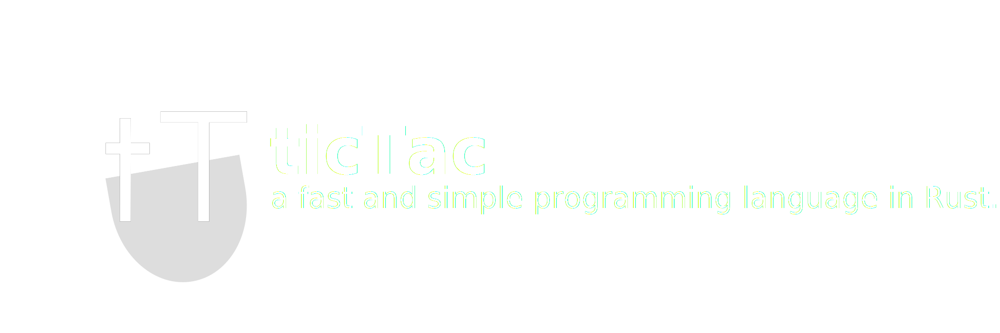

<h1 align="center">tictac</h1>

<p align="center">TicTac is a language written in Rust meant to be fast and simple.</p>

It has two modes, compiler and evaluator. The compiler one compiles to assembly that gets built by the assembler (GNU Assmebler) and the evalutor runs on runtime. For both of them, they go through Lexer and Generalize so output will be similar, if not the same.

## Contributors

| Who                                                                                                   | Role                                   |
| ----------------------------------------------------------------------------------------------------- | -------------------------------------- |
| <br>@actuallyexeon | Creator                                |
| <br>@datkat21        | Helped with the logo, docs, and readme |

## Syntax

Function definition:

```rust
(function_name) -> {function_arguments}|{
    // your code
}
```

(eg.):

```rust
(main) -> {}:int|{
    =msg <- "Hello, World";
    (eprint) -> {=msg};
}
```

Function running: ``(function_name) -> {function arguments}`` <br>(eg.): ``(eprint) -> {"Hello"}``

## Errors

We have an error table showing all the current possible errors at the time of writing:

| Error              | Meaning                                                                       |
| ------------------ | ----------------------------------------------------------------------------- |
| `NoSemicolon`      | Has no semicolon.                                                             |
| `UnknownChar`      | Found a character that the lexer doesn't know.                                |
| `EndBracseAdvance` | Either placed and unmatcher brace, corrupted memory or error in my dumb code. |
